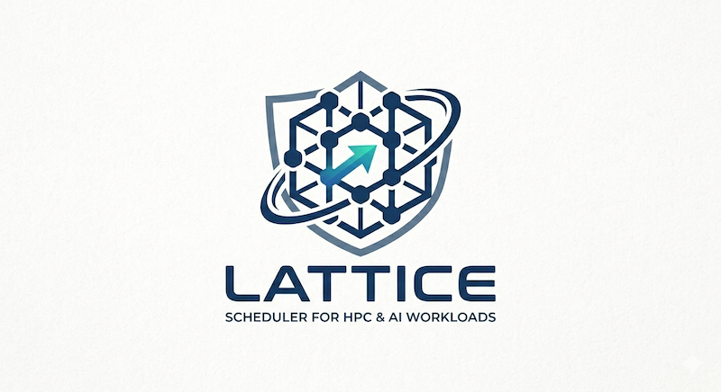

<p align="center">
  
</p>

<p align="center">
  <a href="https://github.com/witlox/lattice/actions/workflows/ci.yml"></a>
  <a href="https://codecov.io/gh/witlox/lattice"></a>
  <a href="https://github.com/witlox/lattice/blob/main/LICENSE"></a>
  <a href="https://github.com/witlox/lattice"></a>
</p>

---

A distributed workload scheduler for large-scale scientific computing, AI/ML training, inference services, and regulated workloads. Lattice schedules both finite jobs (batch training, simulations) and infinite jobs (inference services, monitoring) on shared HPC infrastructure with topology-aware placement and a unified API for human users and autonomous agents.

## Design Principles

- **Full-node scheduling** — the scheduler reasons about whole nodes; the node agent handles intra-node packing via Sarus and uenv
- **Intent-based API with Slurm compatibility** — agents declare what they need, users can use familiar `sbatch`-like commands
- **Distributed control plane** — Raft quorum with persistent WAL, snapshots, and backup/restore; per-vCluster schedulers for workload-specific policies
- **uenv-native software delivery** — SquashFS user environments as the default, OCI containers when isolation is needed
- **Regulated workload support** — user-level node claims, dedicated nodes, encrypted storage, full audit trail with 7-year retention
- **Federation as opt-in** — multi-site operation via Sovra trust layer, fully functional without it

## Architecture

```
User Plane         FirecREST API Gateway (OIDC/SAML)
Software Plane     uenv (SquashFS) + Sarus (OCI) + Registry
Scheduling Plane   Raft Quorum + vCluster Schedulers (knapsack)
Data Plane         VAST (NFS/S3) tiered storage + data mover
Network Fabric     Slingshot / Ultra Ethernet (libfabric)
Node Plane         Node Agent + mount namespaces + eBPF telemetry
Infrastructure     OpenCHAMI (Redfish BMC, boot, inventory)
```

The scheduler uses a multi-dimensional knapsack algorithm with a composite cost function covering priority, wait time, fair share, topology fitness, data readiness, backlog pressure, energy cost, checkpoint efficiency, and conformance fitness. Weights are tunable per vCluster and testable offline with the RM-Replay simulator.

See [docs/architecture/](docs/architecture/) for detailed design documents and [docs/decisions/](docs/decisions/) for ADRs.

## Repository Structure

```
crates/
├── lattice-common/        Shared types, config, protobuf bindings
├── lattice-quorum/        Raft consensus, persistent WAL, snapshots, backup/restore
├── lattice-scheduler/     vCluster schedulers, knapsack solver, cost function
├── lattice-api/           gRPC (tonic) + REST (axum) server, OIDC, RBAC, mTLS
├── lattice-checkpoint/    Checkpoint broker, cost evaluator
├── lattice-node-agent/    Per-node daemon, GPU/memory discovery, eBPF telemetry, data staging
├── lattice-cli/           CLI binary (submit/status/cancel/session/telemetry)
├── lattice-test-harness/  Shared mocks, fixtures, builders
└── lattice-acceptance/    BDD scenarios (cucumber) + property tests (proptest)
proto/                     Protobuf definitions (API contract)
sdk/python/                Python SDK (httpx REST client, 18 async methods)
tools/rm-replay/           Scheduler simulator (real + simple cost modes)
infra/                     Dockerfiles, docker-compose, systemd, Grafana, alerting
config/                    Example configuration files (minimal + production)
scripts/                   Release version patching
docs/
├── architecture/          30 design documents
├── decisions/             Architecture Decision Records
└── references/            External references
```

## Building

```bash
# Build the workspace
cargo build --workspace

# Run tests (1169 unit/integration + 68 BDD scenarios)
just test              # default: skips slow multi-node Raft tests
just test-all          # full suite including slow tests
just test-slow         # only slow tests

# Or without just
cargo test --workspace                       # skips #[ignore] (slow)
cargo test --workspace -- --include-ignored  # everything

# Lint and check
cargo fmt --all -- --check
cargo clippy --workspace --all-targets
cargo deny check

# Or use just
just all
```

### Python SDK

```bash
cd sdk/python
pip install -e .
pytest
```

### Docker

```bash
cd infra/docker
docker compose up
```

## Technology Stack

| Component | Language | Key Dependencies |
|---|---|---|
| Scheduler core (9 crates) | Rust | tokio, tonic, prost, openraft, axum, flate2, tar |
| Security | Rust | jsonwebtoken (OIDC), rcgen (mTLS), RBAC middleware |
| Observability | Rust | prometheus, eBPF (Linux), nvml-wrapper (NVIDIA) |
| User SDK | Python | httpx, pytest |
| Simulator | Rust | Real cost evaluator from lattice-scheduler |
| Protobuf | buf | Rust (tonic/prost) generation |
| Deployment | Docker/systemd | Multi-stage builds, Grafana dashboards |

## External Integrations

| System | Role |
|---|---|
| [OpenCHAMI](https://openchami.org) | Infrastructure management (Redfish BMC) |
| [FirecREST](https://github.com/eth-cscs/firecrest) | User API gateway |
| [uenv](https://github.com/eth-cscs/uenv) / [Sarus](https://github.com/eth-cscs/sarus) | Software delivery (SquashFS / OCI) |
| [Sovra](https://github.com/witlox/sovra) | Federation trust (optional) |
| VAST | Tiered storage (NFS + S3) |
| Waldur | Accounting and billing (optional) |

## Contributing with Claude Code

This project includes structured [Claude Code](https://claude.com/claude-code) profiles for different development phases: analyst, architect, adversary, contract-gen, implementer, and integrator. Each profile constrains Claude to a specific role in the workflow.

```bash
# Activate a profile (writes to .claude/CLAUDE.md, which is gitignored)
./switch-profile.sh architect

# Implementer profile with feature scope
./switch-profile.sh implementer "user-authentication"
```

The root `CLAUDE.md` provides project context and is always loaded alongside the active profile. See [`.claude/WORKFLOW.md`](.claude/WORKFLOW.md) for the full workflow documentation.

## License

[Apache-2.0](LICENSE)
